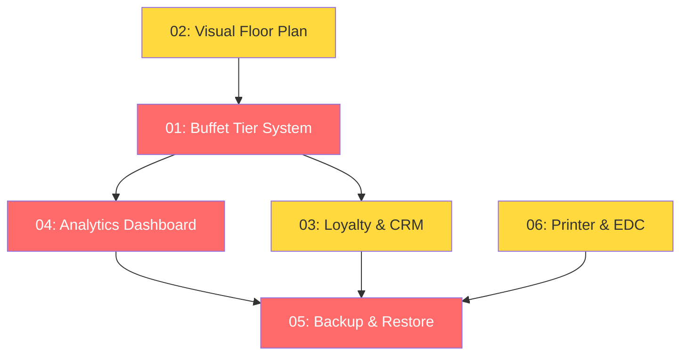

# 📋 POS Enhancement Architectures — Overview

> **Project:** thai-pos-demo  
> **Architecture:** Clean Architecture + Riverpod + Isar  
> **Created:** 2026-04-04

---


---

## 📊 สถานะปัจจุบัน vs แผนพัฒนา

| # | Architecture | สถานะปัจจุบัน | เป้าหมาย | Priority |
|---|-----------|---------------|----------|----------|
| 1 | [Buffet Tier & Headcount](./01_buffet_tier_system.md) | มี `headcount` พื้นฐาน, PricingEngine พร้อม | ระบบ Tier ครบ (Silver/Gold/Platinum), แยก Adult/Child | 🔴 สูง |
| 2 | [Visual Floor Plan](./02_visual_floor_plan.md) | ใช้ Grid สี่เหลี่ยมเรียบง่าย | Drag & Drop วาดแผนผังร้านจริง + Objects (ผนัง, ต้นไม้) | 🟡 กลาง |
| 3 | [Loyalty & CRM](./03_loyalty_crm.md) | ไม่มี | ระบบสมาชิก, สะสมแต้ม, ส่วนลด | 🟡 กลาง |
| 4 | [Analytics Dashboard](./04_analytics_dashboard.md) | ไม่มี | กราฟยอดขาย, Reports, Export | 🔴 สูง |
| 5 | [Data Backup & Restore](./05_backup_restore.md) | ไม่มี | Export/Import ZIP (Isar + Images) | 🔴 สูง |
| 6 | [Printer & EDC Enhancement](./06_printer_edc.md) | มี Bluetooth Thermal พื้นฐาน | Receipt Designer, EDC Integration | 🟡 กลาง |

---

## 📁 โครงสร้างสถาปัตยกรรม (Architectures)

```
architectures/
├── 00_framework_foundation.md   ← (Foundation) ระบบหลายโหมด
├── 01_buffet_tier_system.md    ← ระบบ Buffet Tier & Headcount
├── 02_visual_floor_plan.md     ← แผนผังร้านแบบ Visual
├── 03_loyalty_crm.md           ← ระบบสมาชิกและแต้มสะสม
├── 04_analytics_dashboard.md   ← หน้า Dashboard และรายงาน
├── 05_backup_restore.md        ← ระบบสำรอง/กู้คืนข้อมูล
├── 06_printer_edc.md           ← เครื่องพิมพ์/เครื่องรูดบัตร
├── 07_restaurant_flow.md      ← ขั้นตอนการขายสำหรับร้านอาหาร
└── 08_retail_flow.md          ← ขั้นตอนการขายสำหรับค้าปลีก
```

---

## 🔄 ลำดับการพัฒนาที่แนะนำ



**Phase 1 (สัปดาห์ 1-2):** Buffet Tier System → Analytics  
**Phase 2 (สัปดาห์ 3-4):** Loyalty & CRM → Backup  
**Phase 3 (สัปดาห์ 5-6):** Visual Floor Plan → Printer/EDC

---

## 🏗️ หลักการพัฒนา

1. **ปฏิบัติตาม `AGENTS.md`** ทุกข้อ — Clean Architecture, Riverpod, CSV-first i18n
2. **ไม่ Break ของเดิม** — ใช้ Strategy Pattern และ FeatureCapability เพื่อเปิด/ปิดฟีเจอร์
3. **Test-Driven** — ทุก Feature ต้องมี Unit Test ก่อน UI
4. **Offline-First** — ข้อมูลทั้งหมดเก็บใน Isar, sync ทีหลัง
